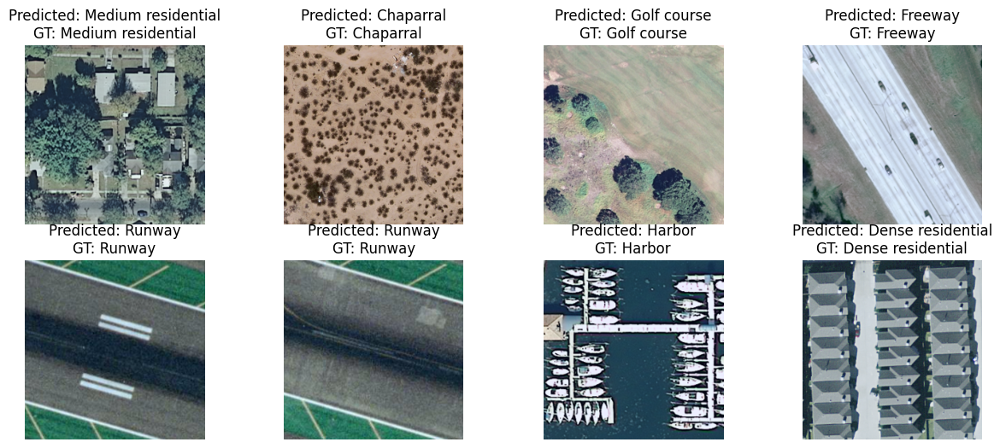

# CNN-Based Classifier

This repository contains a CNN-based model designed for Land Cover Classification.

## Dataset

trained two models:

A model trained on [EuroSAT](https://www.kaggle.com/code/nilesh789/land-cover-classification-with-eurosat-dataset) dataset which is of very low resolution(64 x 64) (10 classes)

And another used [UC_Merced](http://weegee.vision.ucmerced.edu/datasets/landuse.html) dataset which is of higher resolution and more classes (21 classes)

## Model Architecture

Below is the architecture of the CNN-based model for semantic segmentation:

```plaintext
----------------------------------------------------------------
        Layer (type)               Output Shape         Param #
================================================================
            Conv2d-1         [-1, 16, 254, 254]             448
         MaxPool2d-2         [-1, 16, 127, 127]               0
       BatchNorm2d-3         [-1, 16, 127, 127]              32
              ReLU-4         [-1, 16, 127, 127]               0
            Conv2d-5         [-1, 32, 125, 125]           4,640
       BatchNorm2d-6         [-1, 32, 125, 125]              64
              ReLU-7         [-1, 32, 125, 125]               0
            Conv2d-8         [-1, 64, 123, 123]          18,496
       BatchNorm2d-9         [-1, 64, 123, 123]             128
             ReLU-10         [-1, 64, 123, 123]               0
           Conv2d-11        [-1, 128, 122, 122]          32,896
      BatchNorm2d-12        [-1, 128, 122, 122]             256
             ReLU-13        [-1, 128, 122, 122]               0
           Conv2d-14        [-1, 256, 120, 120]         295,168
      BatchNorm2d-15        [-1, 256, 120, 120]             512
             ReLU-16        [-1, 256, 120, 120]               0
           Conv2d-17        [-1, 256, 117, 117]       1,048,832
        MaxPool2d-18          [-1, 256, 39, 39]               0
      BatchNorm2d-19          [-1, 256, 39, 39]             512
             ReLU-20          [-1, 256, 39, 39]               0
        MaxPool2d-21          [-1, 256, 19, 19]               0
          Flatten-22                [-1, 92416]               0
           Linear-23                  [-1, 128]      11,829,376
           Linear-24                   [-1, 64]           8,256
          Dropout-25                   [-1, 64]               0
           Linear-26                   [-1, 32]           2,080
           Linear-27                   [-1, 21]             693
================================================================
Total params: 13,242,389
Trainable params: 13,242,389
Non-trainable params: 0
----------------------------------------------------------------
Input size (MB): 0.75
Forward/backward pass size (MB): 212.43
Params size (MB): 50.52
Estimated Total Size (MB): 263.69
----------------------------------------------------------------
```

## Evaluation Results

On UC-Merced:

`Accuracy : 87.84%`

On EuroSAT:

`Accuracy : 89.3%`

## Inference Results on UC-Merced

Below are some example results from the model, showing the input images, ground truth labels, and the predictions by the model:



## Weight File :
You can find the training weight file on UC-Merced Dataset [here](https://drive.google.com/file/d/1SyOo55bk-3-WmLwfODHZ5JlLvzmF9Ztw/view?usp=sharing)

You can also find the training weight file on EuroSAT Dataset [here](https://drive.google.com/file/d/1INZ-ftHMYnJce9jwsXQHwwnxeKFgmBYG/view?usp=sharing)

## WorkArea:
The `WorkArea.ipynb` is a notebook where I've done the training and inference.
## Gradio Web Interface

A Gradio web interface has been set up to allow users to easily test the model with their own images or use sample images from the dataset. This interface provides a user-friendly way to interact with the model in real-time.

### Running the Gradio Interface

To run the Gradio interface, follow these steps:

1. **Clone the Repository:**

   ```bash
   git clone https://github.com/Hasanmog/CNN-VS-ViT

   cd Classifiers/CNN-Based

   pip install -r requirements.txt

2. **gradio_run.py** :
     
     replace `line 46` with the path of the donwloaded checkpoint.

3. **Run**

Note that this gradio implementation is on the UC_Merced variant only.
